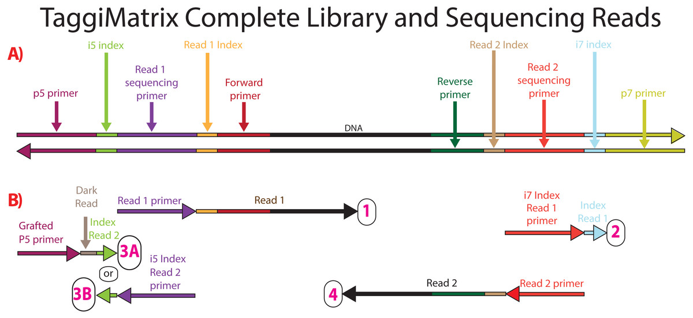

# Introduction

We are using a new protocol for sequencing the HAMBI microbial community that allows for a greater degree of multiplexing by preparing libraries in-house at the University of Turku [Center for Evolutionary Applications](https://www.utu.fi/en/university/faculty-of-science/biology/center-of-evolutionary-applications). The protocol follows the [Adapterama series II](https://peerj.com/articles/7786/). Fusion primers compatible with Illumina iTru primers can be designed using a simple spreadsheet from the supplementary material of the paper. These fusion primers have quadruple indexes - one pair of standard 8 bp Illumina iTru indexes and one pair of custom 5 bp indexes.

# Demultiplexing
For demultiplexing I have been using the pheniqs software ([https://doi.org/10.1186/s12859-021-04267-5](https://doi.org/10.1186/s12859-021-04267-5)) that is [available from here](https://github.com/biosails/pheniqs). There documentation is available [here](https://biosails.github.io/pheniqs/).

The strategy I have used is to first demultiplex on the outer Illumina iTru indexes creating, for example, 6 different demultiplexed bam files as shown here. This is the [dim1](dim1) directory. Then these six bam files are each demultiplexed one-by-one using the pairs of the inner custom indexes in the [dim2](dim2) directory. The Adapteramma II indexes are 5 bp long, but 0-3 bp of spacer precede these indexes meaning that they don't all start at the same sequencing cycle in the read. The spacer sequence is included to create extra diversity at the read positions since these are low-diversity amplicon libraries. My solution has been to incorporate the spacer sequence and then 0-3 bp of the 5' sequence of the 16S primers to ensure that each index is 8 bp long and always starts on the first sequencing cycle.

The indexes for demultiplexing are in [samplesheet.tsv](samplesheet.tsv). The iTru indexes are self explanatory. The `inline_barcode_F_seq`, `inline_barcode_F_seq` show the 5 bp index in capital and the 0-3 bp of spacer in lower case. The `inline_barcode_F_8` and	`inline_barcode_R_8` are the 8 bp indexes starting on the same cycle that either incorporate the spacer sequence or the spacer and part of the 5' end of the `Bact-0341-b-S-17` and `S-D-Bact-0785-a-A-21` 16S primers from the paper.


```
#Forward

>Bact-0341-b-S-17
CCTACGGGNGGCWGCAG

# Reverse

>S-D-Bact-0785-a-A-21
GACTACHVGGGTATCTAATCC
```

# Protocol

## 1. Obtain MiSeq folder output

Ask for the raw output from the sequencer before `bcl2fastq` is run. This should be a directory called something like `220617_M00558_0297_000000000-KGK59`. You can download this using a script like:

```
#!/bin/bash
#SBATCH --job-name=dl_illumina
#SBATCH --account=project_2005776
#SBATCH --time=48:00:00
#SBATCH --mem-per-cpu=1G
#SBATCH --partition=small
#SBATCH --output=dl_output_%j.txt
#SBATCH --error=dl_errors_%j.txt

wget --user USERNAME --password PASSWORD -r -l0 -np "URL_TO_OUTPUT_FOLDER" -P . -A "*"
```
This may take some time since the sequencing center will not not tar or compress the run folder so you must recursively download many image files.

## 2. Clean up the run metadata

Note: first must convert the date xml tag from the `RunInfo.xml` file to "American" style - month/day/year - or else the parser fails

## 3. Generate basecall script

You can do this automatically using a python script bundled withd pheniqs

```
pheniqs-illumina-api.py basecall \
--output-dir . \
--fastq-compression-level 3 \
220617_M00558_0297_000000000-KGK59
```

This will generate two files called `000000000-KGK59_basecall_sample_sheet.csv` and `000000000-KGK59_basecall.sh`. The contents of the shell script can be slightly modified as below:

```
#!/bin/bash
#SBATCH --job-name=bcl2fastq
#SBATCH --account=project_2006053
#SBATCH --time=48:00:00
#SBATCH --partition=small
#SBATCH --nodes=1
#SBATCH --ntasks=20
#SBATCH --mem-per-cpu=4000

module load bcl2fastq

bcl2fastq \
--runfolder-dir 220617_M00558_0297_000000000-KGK59 \
--sample-sheet 000000000-KGK59_basecall_sample_sheet.csv \
--create-fastq-for-index-reads \
--adapter-stringency 0 \
--minimum-trimmed-read-length 0 \
--mask-short-adapter-reads 0 \
--output-dir . \
--fastq-compression-level 3 \
--loading-threads 4 \
--processing-threads 12 \
--writing-threads 4
```

The basecalling script will generate 4 fastq files - 2 Illumina TruSeq index files and 2 read files. These are necessary to pass to the pheniqs software.

## 4. Demultiplexing dimension 1

I basically adapted the [Fluidigm tutorial](https://biosails.github.io/pheniqs/fluidigm_vignette) for these steps.

The structure of the dual indexed sequencing reads is as follows ([10.7717/peerj.7786/fig-3](https://peerj.com/articles/7786/#fig-3))



There are two dimensions along which we demultiplex - the outer Illumina TruSeq indexes (i5 and i7 in the figure) and the inner custom indexes (R1 index and R2 index in the figure). We first demultiplex the TruSeq index pairs - follow the [`pipeline.sh`](./dim1/pipeline.sh) and adapt the json config files to your specific use case. This should produce X individual bam files (1 for each TruSeq index pair) in the `dim1` directory. 

## 5. Demultiplexing dimension 2

This basically repeats the steps from step 4 but we are demultiplexing on the 8 bp indexes (R1 and R2 indexes). But we need to create config json files for each of the X bam files produced in step 4 above in a new directory with the same name as the bam file generated in step 4 above (e.g., [`KGK59_AACAACCGCGACACTT`](./dim2/KGK59_AACAACCGCGACACTT)) We also do a new prior estimation for the R1 and R2 indexes. Follow the dim2 [`KGK59_AACAACCGCGACACTT/pipeline.sh`](./dim2/KGK59_AACAACCGCGACACTT/pipeline.sh)) and adapt the json config files to your specific use case. This should produce X individual fastq files (1 for each Adapterama index pair) in the `dim2` directory.